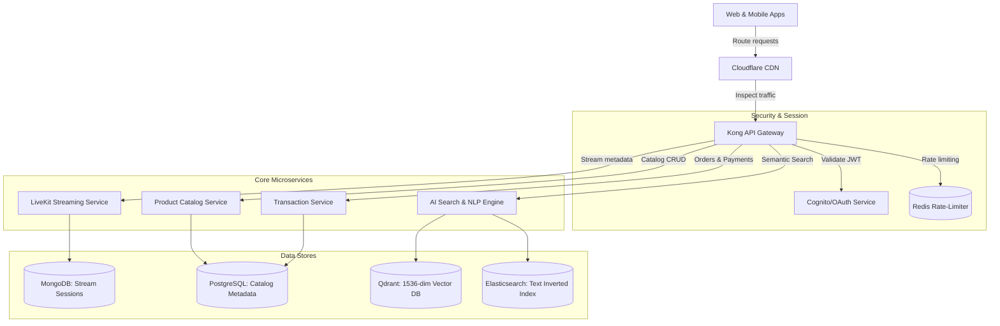

# 🎥 LiveShop AI — Interactive Live Commerce Platform (V2.0)

[](LICENSE)
[](https://react.dev/)
[](https://fastapi.tiangolo.com/)
[](https://qdrant.tech/)

> **Shop While Watching:** A next-generation interactive live commerce platform that merges low-latency streaming entertainment with instant purchasing.

---

## 🌟 Key Features

*   **Zero-Friction Checkout:** Buy showcased or pinned products in under 15 seconds via side-by-side transaction overlays without leaving the stream.
*   **AI-Powered Semantic Discovery:** Intent-driven conversational search combining OpenAI text embeddings (`text-embedding-3-small`) and Qdrant vector database queries for semantic product recommendations.
*   **Visual Product Search:** Drag-and-drop video frame scanner to map visual coordinates and find similar catalog items using visual embeddings.
*   **Synchronized Host Overlays:** Live broadcaster interaction tools including interactive polling, real-time reactions, flash deal pins, and live chat.
*   **Merchant Console:** Real-time stream performance analytics, SVG revenue charts, active poll builder, and catalog management panel.

---

## 🛠 Tech Stack

### Frontend
- **Framework:** React 19 (SPA)
- **Bundler & Dev Server:** Vite 8
- **Styling:** Vanilla CSS (Glassmorphism & micro-animations)
- **Icons:** Lucide React

### Backend & AI Infrastructure (Production Architecture)
- **Application Services:** FastAPI (Python) on AWS EKS
- **Databases:** PostgreSQL (Relational transactions/users), MongoDB (Catalog & streams), Qdrant (1536-dim Vector Database)
- **Real-Time StreamSFU:** LiveKit SFU / Agora WebRTC channels
- **Transcoding Pipeline:** AWS Elemental MediaLive (multirate HLS) + Amazon S3 & CloudFront CDN
- **AI Models:** OpenAI Embeddings API & GPT-based conversational parsing

---

## 📐 System Architecture

### High-Level System Workflow


---

## 🚀 Getting Started

### Prerequisites
- [Node.js](https://nodejs.org/) (v18+ recommended)
- Git

### Installation & Development Setup

1. **Clone the Repository:**
   ```bash
   git clone https://github.com/vijaymahes9080/LiveShop-AI-Interactive-Live-Commerce-Platform.git
   cd "LiveShop AI — Interactive Live Commerce Platform"
   ```

2. **Install Frontend Dependencies:**
   ```bash
   npm install
   ```

3. **Start Frontend Development Server:**
   ```bash
   npm run dev
   ```
   *The client application will run at `http://localhost:5173`.*

4. **Build for Production:**
   ```bash
   npm run build
   ```

---

## 📄 License

This project is licensed under the MIT License - see the [LICENSE](LICENSE) file for details.

---

## 👤 Author

**Vijay Mahes**
- Email: [Vijaypradhap2004@gmail.com](mailto:Vijaypradhap2004@gmail.com)
- GitHub: [@vijaymahes9080](https://github.com/vijaymahes9080)
