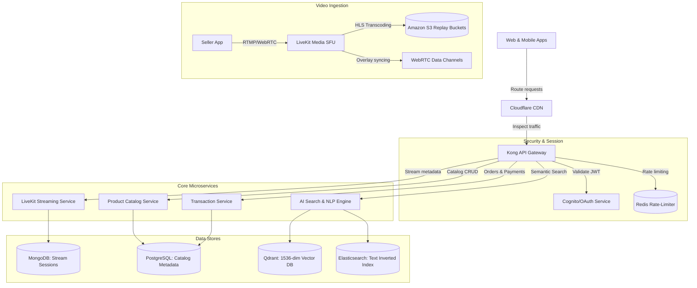
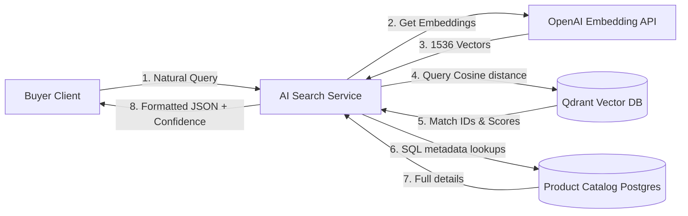
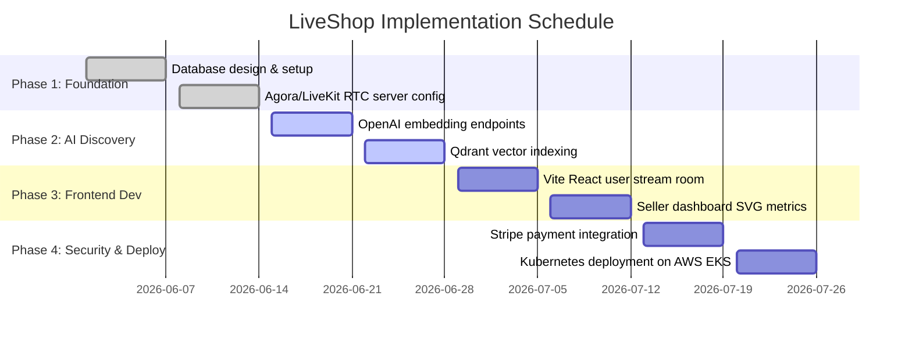

# Engineering Design Report — AI Live Shopping Platform

**Project Title**: AI Live Shopping Platform – Shop While Watching (Live Commerce)  
**Author**: Senior Product Architect & AI Solutions Engineer  
**Status**: Production-Ready Design Specification  

---

## 1. Project Overview & Background
The **AI Live Shopping Platform** is a next-generation interactive live commerce platform designed to merge streaming entertainment with instant purchasing. Rather than navigating away from streams, buyers watch interactive videos, engage in real-time chats, participate in audience polls, and buy pinned products instantly using AI semantic discovery.

---

## 2. Problem Statement
1. **Purchase Friction**: Traditional live streams on social platforms require users to leave the video screen, navigate to a third-party website, search for a showcased item, and complete checkout. This results in drop-off rates exceeding **70%**.
2. **Keyword Search Limitations**: Product catalogs rely on exact keyword matches, failing to understand natural user intents (e.g., *"Suggest breathable sneakers under ₹3000 for high-humidity runs"*).
3. **Disconnected Visual Discovery**: Users seeing items inside video frames cannot perform quick visual searches without extracting screenshots and uploading them to separate visual engines.

---

## 3. Objectives
- **Zero-Friction Checkout**: Allow checkout in less than **15 seconds** with side-by-side overlays.
- **Intent-Driven Discovery**: Provide hybrid vector search combining text embeddings (OpenAI `text-embedding-3-small`) and traditional inverted indexes (Elasticsearch) for conversational product matching.
- **Real-Time Synchronous Overlays**: Synchronize host actions (pinned products, active polls, flash discounts) with millisecond-level latency using WebRTC data channels.

---

## 4. Platform Features Matrix
| Module | Capability | Implementation Strategy |
| :--- | :--- | :--- |
| **1. Live Streaming** | Low-latency WebRTC streams, Multi-camera feeds, Reaction bursts | Agora/LiveKit SFUs, HLS transcoding for replays, custom keyframe floating CSS |
| **2. AI Discovery** | Semantic NLP query extraction, Vector similarity scoring, Re-ranking | OpenAI Embeddings, Qdrant Vector database cosine indexing, Hybrid BM25 matching |
| **3. Visual Shopping** | Drag-drop scanner, coordinate coordinates overlays, visually similar matches | Image classification visual embeddings, OpenCV/YOLO coordinate mapping |
| **4. Transactional Portal** | Cart checkout drawers, coupon modules, dynamic invoice printers | UPI Deeplinking, Stripe/Razorpay integrations, PDF invoice formatting |
| **5. Merchant console** | Broadcaster dashboard, active poll builders, real-time revenue analytics | SVG custom charts, product catalog indexing logs, stream quality switchers |
| **6. Security node** | Fraud prevention alerts, Rate-limit nodes, PCI secure gateways | JWT validation, Redis token buckets, SSL TLS 1.3 encryption |

---

## 5. System Design & Architecture

### High-Level System Architecture


### Data Flow Diagram (DFD Level-1)


---

## 6. Database Design & Schemas

### Relational Schema (PostgreSQL) — User, Order, Transaction Models
```sql
-- Core Users Table
CREATE TABLE users (
    id UUID PRIMARY KEY DEFAULT gen_random_uuid(),
    email VARCHAR(255) UNIQUE NOT NULL,
    password_hash VARCHAR(255) NOT NULL,
    first_name VARCHAR(100),
    last_name VARCHAR(100),
    created_at TIMESTAMP WITH TIME ZONE DEFAULT CURRENT_TIMESTAMP,
    updated_at TIMESTAMP WITH TIME ZONE DEFAULT CURRENT_TIMESTAMP
);

-- Merchant Profile Table
CREATE TABLE sellers (
    id UUID PRIMARY KEY DEFAULT gen_random_uuid(),
    user_id UUID REFERENCES users(id) ON DELETE CASCADE,
    business_name VARCHAR(255) UNIQUE NOT NULL,
    logo_url VARCHAR(512),
    commission_tier NUMERIC(4,2) DEFAULT 10.00, -- e.g. 10.00%
    is_verified BOOLEAN DEFAULT FALSE,
    bank_account_hash VARCHAR(255),
    created_at TIMESTAMP WITH TIME ZONE DEFAULT CURRENT_TIMESTAMP
);

-- Order History Table
CREATE TABLE orders (
    id UUID PRIMARY KEY DEFAULT gen_random_uuid(),
    buyer_id UUID REFERENCES users(id) ON DELETE SET NULL,
    seller_id UUID REFERENCES sellers(id) ON DELETE SET NULL,
    subtotal_cents INTEGER NOT NULL, -- Currency represented in minor units
    discount_cents INTEGER DEFAULT 0,
    delivery_cents INTEGER DEFAULT 0,
    total_cents INTEGER NOT NULL,
    shipping_address TEXT NOT NULL,
    order_status VARCHAR(50) DEFAULT 'PENDING', -- PENDING, PROCESSING, SHIPPED, DELIVERED, CANCELLED
    created_at TIMESTAMP WITH TIME ZONE DEFAULT CURRENT_TIMESTAMP
);

-- Order Item Line Details
CREATE TABLE order_items (
    id UUID PRIMARY KEY DEFAULT gen_random_uuid(),
    order_id UUID REFERENCES orders(id) ON DELETE CASCADE,
    product_id VARCHAR(100) NOT NULL, -- Cross-references MongoDB/PostgreSQL Product ID
    quantity INTEGER NOT NULL CHECK (quantity > 0),
    unit_price_cents INTEGER NOT NULL
);

-- Transaction Gateway Logs
CREATE TABLE transactions (
    id UUID PRIMARY KEY DEFAULT gen_random_uuid(),
    order_id UUID REFERENCES orders(id) ON DELETE CASCADE,
    gateway_txn_id VARCHAR(255) UNIQUE NOT NULL,
    payment_method VARCHAR(50) NOT NULL, -- UPI, CREDIT_CARD, NET_BANKING, COD
    gateway_status VARCHAR(50) NOT NULL, -- SUCCESS, FAILED, REFUNDED
    amount_cents INTEGER NOT NULL,
    gateway_response_log JSONB,
    created_at TIMESTAMP WITH TIME ZONE DEFAULT CURRENT_TIMESTAMP
);
```

### Document Schema (MongoDB) — Catalog & Active Live Streams
```json
// Collection: products
{
  "_id": "648a85f401b2a472c98c21a1",
  "name": "SwiftGlide Carbon Running Shoes",
  "category": "Footwear",
  "brand": "Velo",
  "price": 4999.00,
  "discount": 8.0,
  "rating": 4.7,
  "deliverySpeed": "1 Day",
  "color": "Neon Lime",
  "size": "UK 9",
  "sustainabilityScore": 82,
  "popularity": 94,
  "description": "Pro carbon-fiber propulsion plate, supercritical nitrogen-infused foam midsole.",
  "vectorId": "footwear-1", // Maps to Qdrant vector database payload
  "inventory": {
    "UK 8": 45,
    "UK 9": 12,
    "UK 10": 8
  }
}

// Collection: streams
{
  "_id": "648a85f401b2a472c98c21b5",
  "title": "Summer Streetwear & Eco-Fashion Drop!",
  "sellerId": "9b1deb4d-3b7d-4bad-9bdd-2b0d7b3dcb6d",
  "live_viewers": 1420,
  "video_url": "https://video.liveshop.ai/stream/aria_summer_drop.m3u8",
  "pinned_product_id": "648a85f401b2a472c98c21a1",
  "showcase_product_ids": [
    "648a85f401b2a472c98c21a1",
    "648a85f401b2a472c98c21a2"
  ],
  "poll": {
    "question": "Which organic hoodie color should we dropship next?",
    "options": [
      { "text": "Lilac Lavender", "votes": 420 },
      { "text": "Earth Sage", "votes": 615 }
    ],
    "totalVotes": 1035
  },
  "created_at": "2026-06-22T19:40:00Z"
}
```

---

## 7. API Gateway Specifications (OpenAPI Style)

### A. AI Semantic Query Endpoint
* **URL**: `/api/v2/search/ai`
* **Method**: `POST`
* **Payload**:
```json
{
  "query": "coding laptop under ₹60000 with organic materials",
  "userId": "9b1deb4d-3b7d-4bad-9bdd-2b0d7b3dcb6d"
}
```
* **Success Response (200 OK)**:
```json
{
  "confidenceScore": 0.94,
  "parsedIntent": {
    "category": "Tech",
    "priceCeiling": 60000,
    "sustainability": true
  },
  "results": [
    {
      "id": "tech-1",
      "name": "AeroBlade Pro Gaming Laptop",
      "price": 58999,
      "sustainabilityScore": 78
    }
  ],
  "similarItems": []
}
```

### B. Live Stream Product Pinning Endpoint
* **URL**: `/api/v2/streams/{streamId}/pin`
* **Method**: `PUT`
* **Headers**: `Authorization: Bearer <JWT>` (Seller Scope Required)
* **Payload**:
```json
{
  "productId": "648a85f401b2a472c98c21a1"
}
```
* **Success Response (200 OK)**:
```json
{
  "status": "PINNED",
  "pinnedProductId": "648a85f401b2a472c98c21a1",
  "timestamp": "2026-06-22T19:42:00Z"
}
```

---

## 8. AI Flow & Recommendation Architecture

### Vector Pipeline & LLM Prompting
1. **Embedding Generator**: User queries are stripped of emojis and special characters, then sent to OpenAI's `/v1/embeddings` endpoint using model `text-embedding-3-small` (1536 dimensions).
2. **Qdrant Vector Database**: Queries the vector index using **Cosine Similarity**:
   $$\text{Similarity}(u, v) = \frac{u \cdot v}{\|u\| \|v\|}$$
3. **Conversational LLM Prompt**: The conversational shopping assistant formats product catalog structures using prompt templates:
```
System Prompt:
You are an expert live shopping assistant. Recommend products using strictly the provided JSON database list.
If a user specifies a budget limit, filter the JSON data immediately before returning response.
Do not make up specs or items not present in database.

User Input:
Need running shoes under 6000.

Context:
[{"name": "SwiftGlide Carbon Running Shoes", "price": 4999, "sustainability": 82}]
```

---

## 9. Security Node Implementation
- **API Authentication**: Kong API gateway enforces JWT validation on all `/api/v2/seller/*` and `/api/v2/admin/*` endpoints. Tokens expire in **60 minutes** with RSA 256 keys.
- **Spam Prevention & Rate Limiting**: Implemented via Redis sliding-window algorithms:
  - Public search endpoint: **60 requests/minute** per IP.
  - Live stream chat post: **10 messages/minute** per user.
- **Card Payment Vaulting**: The platform never stores raw credit card PANs or CVVs. All inputs are mapped to external Secure Vault Tokens via **PCI-DSS Level 1** endpoints (Stripe Elements or Razorpay Secure).

---

## 10. Implementation Roadmap & Deployment Plan

### Development Phases


### Infrastructure & Deployment Setup
- **App Hosting**: Vercel for the React Single Page Application (SPA).
- **Backend APIs**: FastAPI (Python) backend services deployed on **AWS Elastic Kubernetes Service (EKS)** with Auto-Scaling nodes based on CPU threshold (&gt;75%).
- **Media Transcoding Pipeline**: AWS Elemental MediaLive transcodes raw RTC feeds into multi-bitrate HLS (1080p, 720p, 480p) stored inside S3 buckets, distributed via **Cloudfront CDN** edge caches.

---

## 11. Business Model & Growth Strategy

### A. Revenue Model
- **Commission fees**: Take a standard **10% transaction fee** on all products purchased directly during live streams.
- **Seller SaaS Subscription Packages**:
  - **Free Starter**: Up to 3 live streams/month, standard HLS streaming, 15% marketplace commission.
  - **Pro Merchant (₹2,999/month)**: Unlimited live streams, WebRTC ultra-low latency streaming, custom overlays, 8% commission.
  - **Enterprise Scale (₹14,999/month)**: Custom white-label domain streaming, AI metrics analytics, dedicated support nodes, 5% commission.
- **Sponsored Highlights**: Merchants pay fees to boost their streams onto the consumer's landing page recommendation feed.

### B. Growth & Scaling Roadmap (12 Months)
```
Quarter 1 (M1-M3) ──► Launch closed alpha in Metro Areas (Tech & Fashion Focus)
Quarter 2 (M4-M6) ──► Integrate UPI Autopay & recurring live subscription items
Quarter 3 (M7-M9) ──► Expand AI models to include conversational regional dialects
Quarter 4 (M10-M12) ─► Launch Smart TV Live Shop app (Android TV / Tizen)
```
